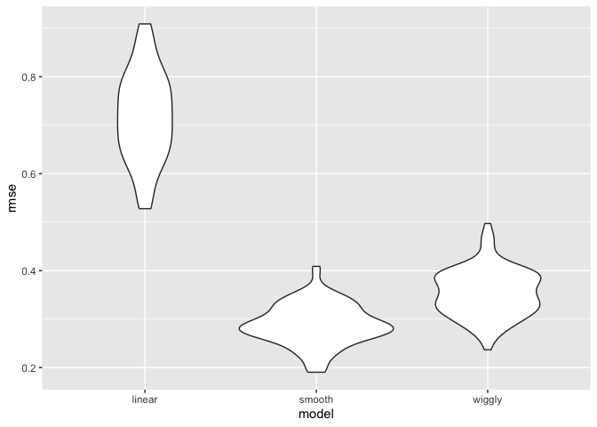

cross validation
================
Chen Liang
2023-11-14

# Nonlinear data and cv

``` r
nonlin_df = 
  tibble(
    id = 1:100,
    x = runif(100, 0, 1),
    y = 1 - 10 * (x - .3) ^ 2 + rnorm(100, 0, .3)
  )

nonlin_df |> 
  ggplot(aes(x = x, y = y)) + 
  geom_point()
```

<!-- -->

## do the train /test split

``` r
train_df = sample_n(nonlin_df, 80)
test_df = anti_join(nonlin_df, train_df, by = "id")

ggplot(train_df, aes(x = x, y = y)) + 
  geom_point() + 
  geom_point(data = test_df, color = "red")
```

<!-- -->

``` r
linear_mod = lm(y ~ x, data = train_df)
smooth_mod = mgcv::gam(y ~ s(x), data = train_df)
wiggly_mod = mgcv::gam(y ~ s(x, k = 30), sp = 10e-6, data = train_df)
```

``` r
train_df |>
  modelr::add_predictions(smooth_mod) |>
  ggplot(aes(x = x, y = y)) + 
  geom_point() +
  geom_line(aes(y=pred))
```

<!-- -->

RMSE on training data can be missleading

``` r
rmse(linear_mod, train_df)
```

    ## [1] 0.7178747

``` r
rmse(smooth_mod, train_df)
```

    ## [1] 0.2874834

``` r
rmse(wiggly_mod, train_df)
```

    ## [1] 0.2498309

``` r
rmse(linear_mod, test_df)
```

    ## [1] 0.7052956

``` r
rmse(smooth_mod, test_df)
```

    ## [1] 0.2221774

``` r
rmse(wiggly_mod, test_df)
```

    ## [1] 0.289051

## use model for CV

``` r
cv_df = 
  crossv_mc(nonlin_df, 100) 
```

``` r
cv_df |> pull(train) |> nth(1) |> as_tibble()
```

    ## # A tibble: 79 × 3
    ##       id      x       y
    ##    <int>  <dbl>   <dbl>
    ##  1     1 0.266   1.11  
    ##  2     2 0.372   0.764 
    ##  3     3 0.573   0.358 
    ##  4     4 0.908  -3.04  
    ##  5     6 0.898  -1.99  
    ##  6     7 0.945  -3.27  
    ##  7     8 0.661  -0.615 
    ##  8     9 0.629   0.0878
    ##  9    10 0.0618  0.392 
    ## 10    11 0.206   1.63  
    ## # ℹ 69 more rows

``` r
cv_df |> pull(test) |> nth(1) |> as_tibble()
```

    ## # A tibble: 21 × 3
    ##       id      x      y
    ##    <int>  <dbl>  <dbl>
    ##  1     5 0.202   1.33 
    ##  2    12 0.177   0.836
    ##  3    19 0.380   0.982
    ##  4    22 0.212   0.710
    ##  5    28 0.382   0.932
    ##  6    31 0.482   0.498
    ##  7    37 0.794  -1.12 
    ##  8    42 0.647   0.158
    ##  9    47 0.0233 -0.148
    ## 10    56 0.0995  1.13 
    ## # ℹ 11 more rows

``` r
cv_df =
  cv_df |> 
  mutate(
    train = map(train, as_tibble),
    test = map(test, as_tibble))
```

``` r
lin_mod_function = function(df){
  lm(y~x,data=df)
}

cv_results = 
  cv_df |>
  mutate(
    linear_fit=map(train,\(df)lm(y~x,data =df)),
    smooth_fit= map(train, ~mgcv::gam(y ~ s(x), data = .x)),
    wiggly_fit  = map(train, ~gam(y ~ s(x, k = 30), sp = 10e-6, data = .x))
  ) |>
  mutate(
    rmse_linear = map2_dbl(linear_fit, test, \(mod,df)rmse(mod,df)),
    rmse_smooth = map2_dbl(smooth_fit, test, ~rmse(model = .x, data = .y)),
    rmse_wiggly = map2_dbl(wiggly_fit, test, ~rmse(model = .x, data = .y)))
```

``` r
cv_results |> 
  select(starts_with("rmse")) |> 
  pivot_longer(
    everything(),
    names_to = "model_type", 
    values_to = "rmse",
    names_prefix = "rmse_") |>
  mutate(model = fct_inorder(model_type)) |> 
  ggplot(aes(x = model, y = rmse)) + geom_violin()
```

<!-- -->
